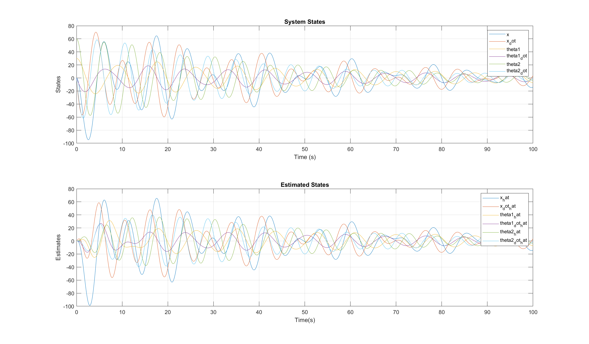

# Design and Implementation of LQR and LQG Controllers for a Crane System
## ENPM667 - Controls for Robotic Systems

## Team Members
- Datta Lohith Gannavarapu: 119455395
- Venkata Sai Sricharan Kasturi: 119444788

## Software Requirements
- **MATLAB**: Any version that supports the files included.

## Contents
The following files are included in this repository:
- **Codes and Results**
  - `Project Code`
    - `Problem_C.m`: MATLAB script for Controllability Check.
    - `Problem_D_1.m`: MATLAB script for LQR Design for a Linear System.
    - `Problem_D_2.m`: MATLAB script for LQR Design for a Non-Linear System.
    - `Problem_E.m`: MATLAB script for Observability Check.
    - `Problem_F1.m`: MATLAB script for Luenberger Observer for Linear Systems.
    - `Problem_F2.m`: MATLAB script for Luenberger Observer for Non-Linear Systems.
    - `Problem_G_1.m`: MATLAB script for LQG Design for a Linear System.
    - `Problem_G_2.m`: MATLAB script for LQG Design for a Non-Linear System.
   - `Results`
      - `d1.png`: Resulting graph for Problem D1.
      - `d2.png`: Resulting graph for Problem D2.
      - `f1.png`: Resulting graph for Problem F1.
      - `f2.png`: Resulting graph for Problem F2.
      - `g1.png`: Resulting graph for Problem G1.
      - `g2.png`: Resulting graph for Problem G2.
  - [`gdatta_charan_report.pdf`](gdatta_charan_report.pdf): Documentation of project findings.
  - `Simulation.gif`: Video showcasing the simulation results.
- `README.md`: This readme file.

## Installation Instructions
To get started with the project, follow these steps:

1. Clone the repository or download the zip file.
2. Open the MATLAB files using MATLAB.
3. Run the relevant scripts to perform the simulations.

## Problem Statement
The provided scripts simulate the results needed to solve the final project requirements for the course.

### Usage
1. Execute the relevant MATLAB scripts based on the problem parts:
    - **Part C**: Controllability Check - [`Problem_C.m`](Project%20Code/Problem_C.m)
    - **Part D(a)**: LQR Design for a Linear System - [`Problem_D_1.m`](Project%20Code/Problem_D_1.m)
    - **Part D(b)**: LQR Design for a Non-Linear System - [`Problem_D_2.m`](Project%20Code/Problem_D_2.m)
    - **Part E**: Observability Check - [`Problem_E.m`](Project%20Code/Problem_E.m)
    - **Part F(a)**: Luenberger Observer for Linear Systems - [`Problem_f1.m`](Project%20Code/Problem_f1.m)
    - **Part F(b)**: Luenberger Observer for Non-Linear Systems - [`Problem_F2.m`](Project%20Code/Problem_F2.m)
    - **Part G(a)**: LQG Design for a Linear System - [`Problem_G_1.m`](Project%20Code/Problem_G_1.m)
    - **Part G(b)**: LQG Design for a Non-Linear System - [`Problem_G_2.m`](Project%20Code/Problem_G_2.m)

2. Each script will execute simulations and display corresponding graphs and matrices.

### Results

The results of the simulations are as follows:

#### Problem D1

#### Problem D2

#### Problem F1

#### Problem F2

#### Problem G1

#### Problem G2

### Simulation Results

## Acknowledgements
We would like to thank our instructors and peers for their support and guidance throughout this project.
